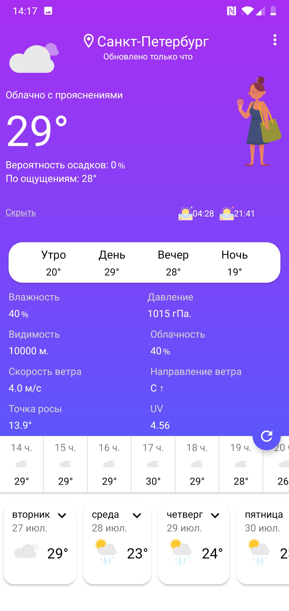
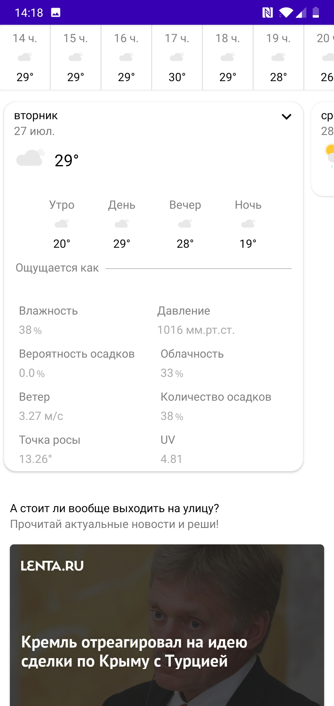

Weather App
===================

Приложение для отображения погоды в разных городах с подробным прогнозом погоды на день и на неделю с ресурса - [Open Weather API](https://openweathermap.org/api). 
В приложении также отображаются актуальные новости с ресурса - [Open Weather API](https://openweathermap.org/api). 

### Архитектура

* [MVVM](https://developer.android.com/jetpack/guide)
* [Kotlin 100%](https://kotlinlang.org/)
* [Coroutines](https://github.com/Kotlin/kotlinx.coroutines)
* [Flow](https://kotlinlang.org/docs/flow.html)

### Preview

### Библиотеки

* Di
    * [Dagger 2](https://github.com/google/dagger)
* Retrofit2 & OkHttp3
    * [Converter: Gson](https://mvnrepository.com/artifact/com.squareup.retrofit2/converter-gson)
    * [Retrofit](https://mvnrepository.com/artifact/com.squareup.retrofit2/retrofit)
    * [OkHttp Logging Interceptor](https://mvnrepository.com/artifact/com.squareup.okhttp3/logging-interceptor)
* Navigation
    * Single Activity
    * [Navigation component](https://developer.android.google.cn/guide/navigation/navigation-getting-started?hl=en)
* Room
    * [Android Room Runtime](https://mvnrepository.com/artifact/androidx.room/room-runtime)
    * [Android Room Kotlin Extensions](https://mvnrepository.com/artifact/androidx.room/room-ktx)
    * [Android Room Compiler](https://mvnrepository.com/artifact/androidx.room/room-compiler)
* Other
    * [Glide](https://github.com/bumptech/glide)
    * [Lottie](https://lottiefiles.com/)
    * [Material Components For Android](https://mvnrepository.com/artifact/com.google.android.material/material)
    * [Core Kotlin Extensions](https://developer.android.com/kotlin/ktx#core)
